

  

    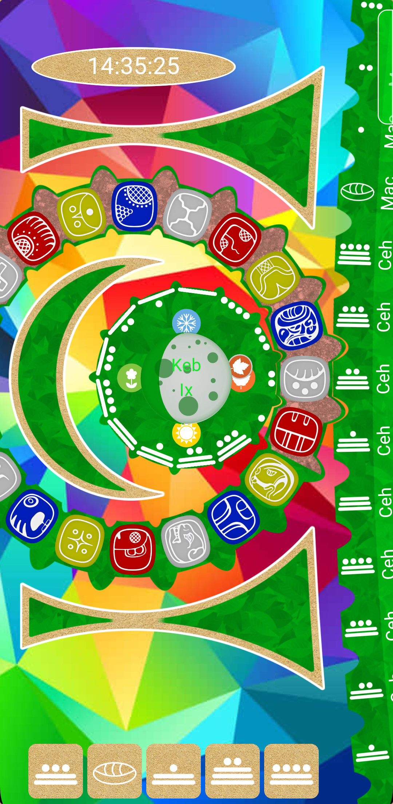
    
    

    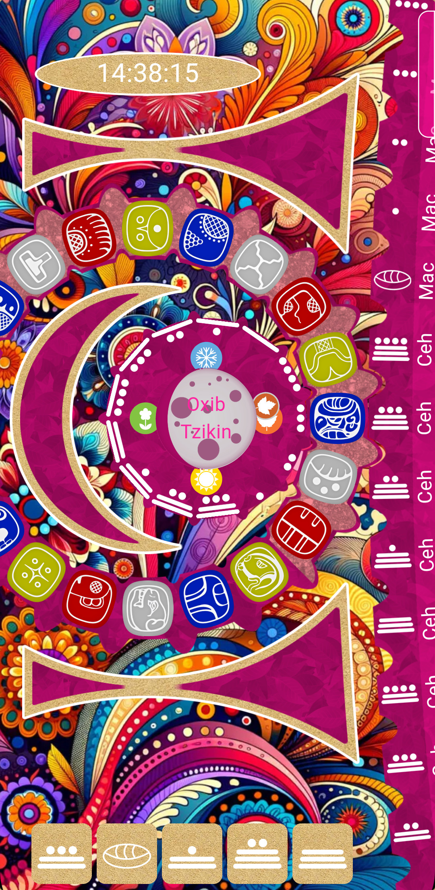
    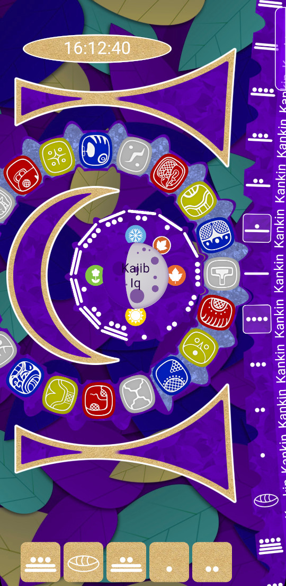
    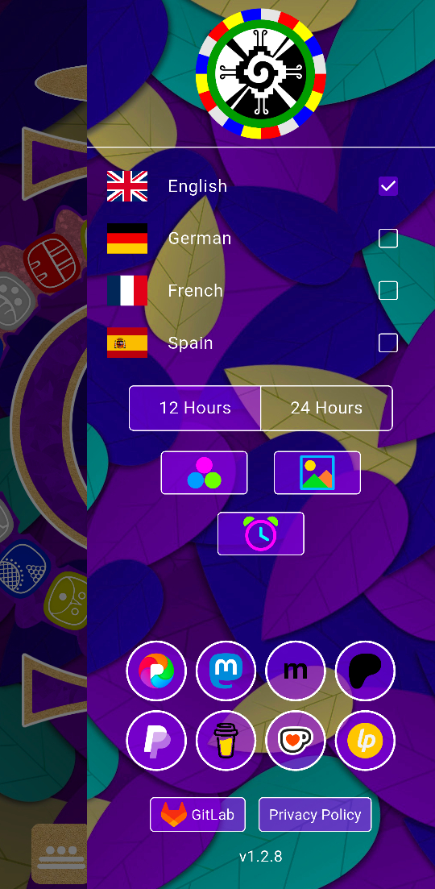

    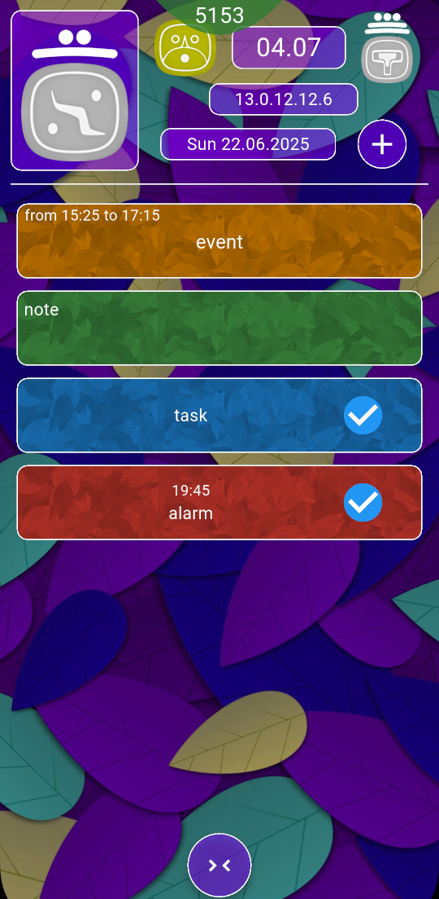
    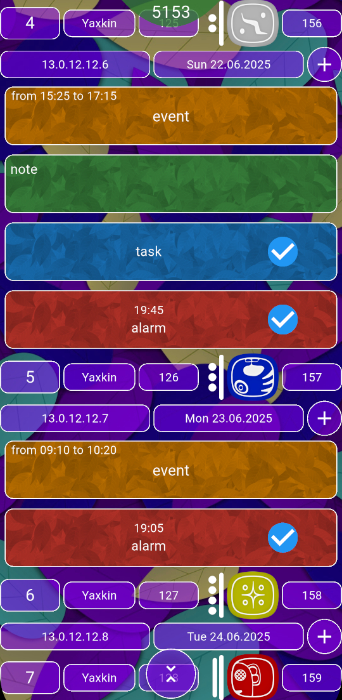
    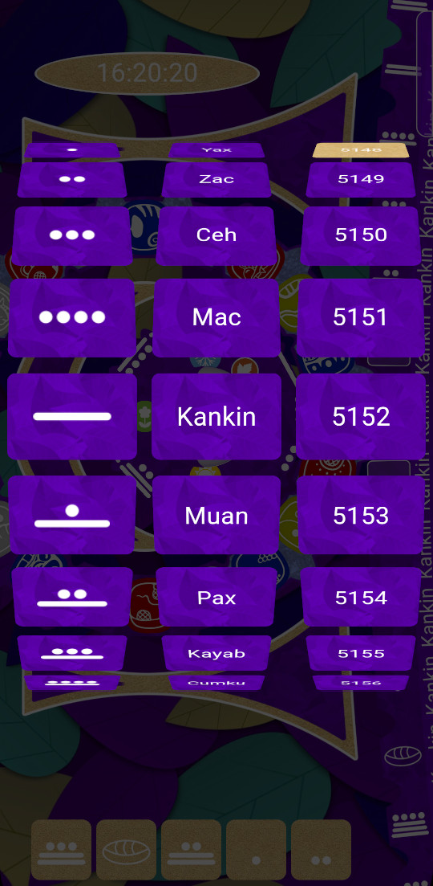

    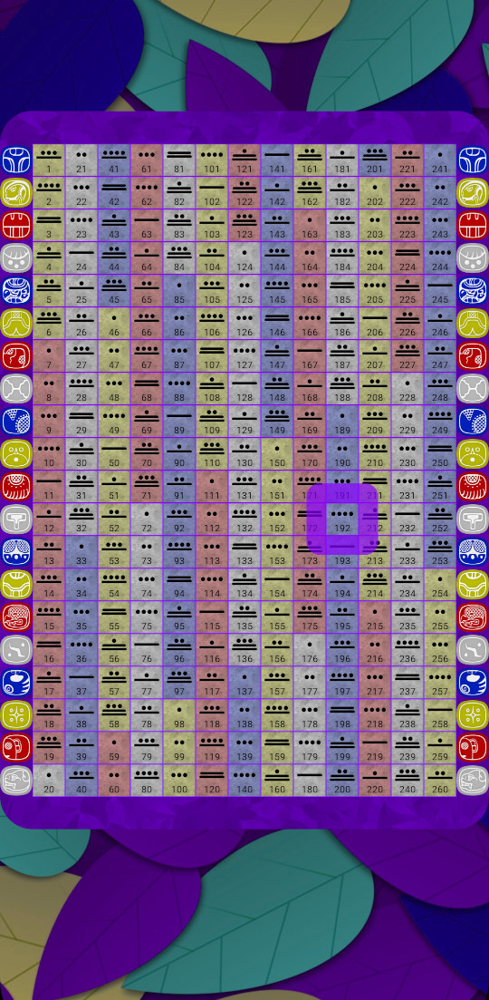
    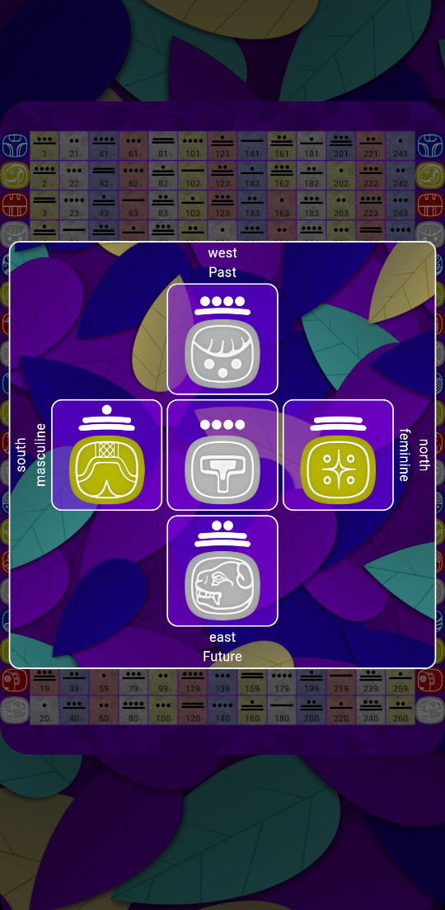
    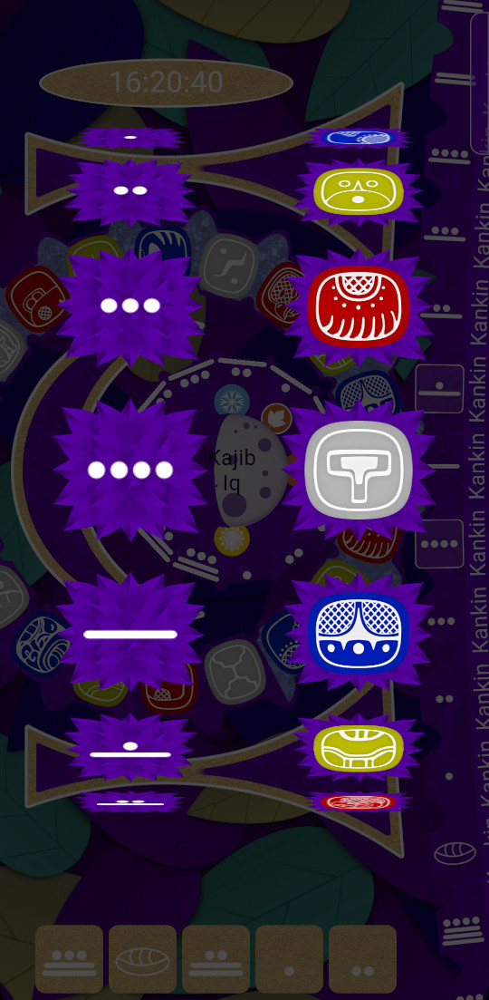  

    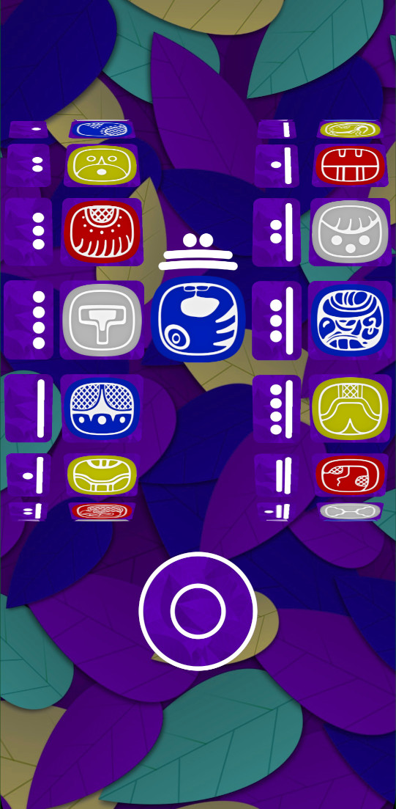
    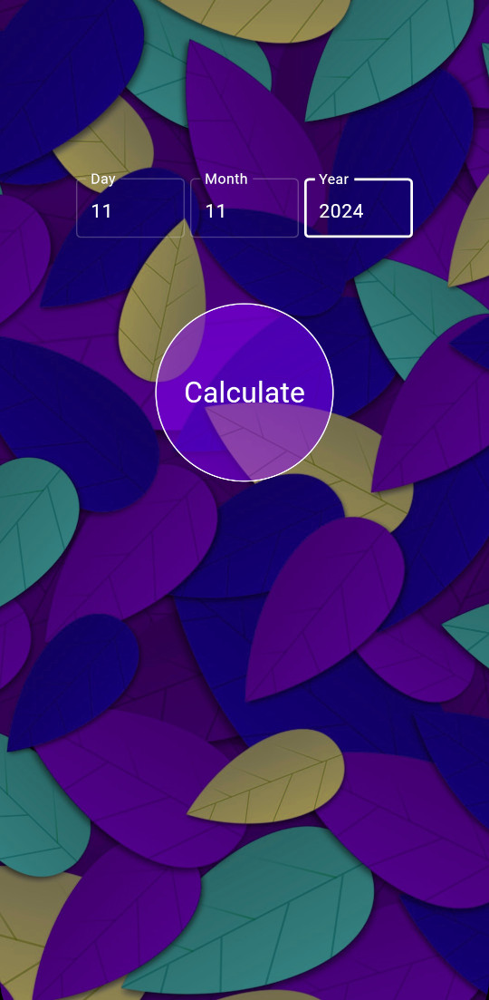
    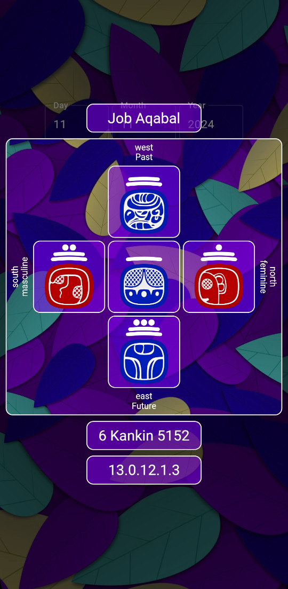

 

    <a href="https://youtube.com/shorts/q73vEcmiXDs">
        Watch on Youtube
    </a>

 

  <table border="0">
    <tr>
      <td>
        
      </td>
      <td>
        
      </td>
    </tr>
  </table>

